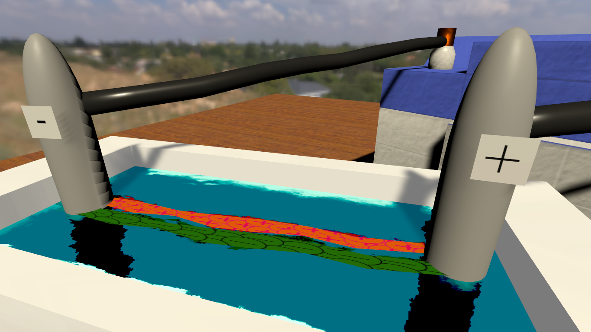

# Electrodynamics
 A demo **(NOT a demoscene production)** for a physics lesson about electrodynamics made with Unity.
 It was made before [Pendulums demo](https://github.com/FedNazar/Pendulums). And, of course,
 [Pendulums](https://github.com/FedNazar/Pendulums) is much better.
 
## Building
 Unity **2020.1.9f1** or higher is required for building the demo.
 
 Since Unity Asset Store EULA doesn't allow me to redistribute Standard Assets package
 you need to [download](https://assetstore.unity.com/packages/essentials/asset-packs/standard-assets-for-unity-2018-4-32351) 
 it yourself. It's free. I used some simple models from Prototyping category. You need to import this package and put Prototyping folder
 into Assets folder.
 
## System Requirements
 - OS: Windows 7 (32-bit or 64-bit) or higher
 - Processor: Intel Core 2 Duo or AMD Athlon 64 X2
 - Graphics Card: Intel HD or equivalent
 - RAM: 2 GB
 
 TL;DR: It runs on a potato. My computer is much better than that!
 
## Screenshots

